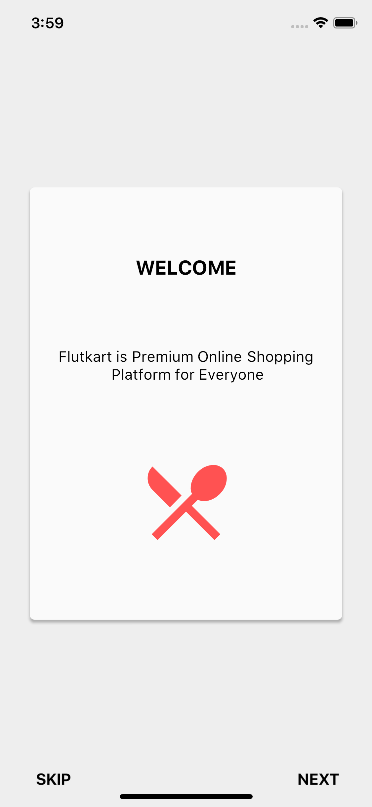
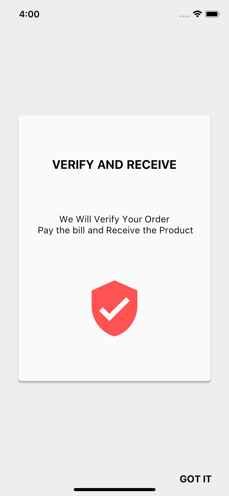

# flutter_walkthrough

A new Flutter package for both android and iOS which helps developers in creating animated walkthrough of their app.

### Show some :heart: and star the repo to support the project

## Screenshots

 

## Usage

[Example](https://github.com/iampawan/Flutter-Walkthrough/blob/master/example/example_app.dart)

To use this package :

* add the dependency to your [pubspec.yaml](https://github.com/iampawan/Flutter-Walkthrough/blob/master/pubspec.yaml) file.

```yaml
  dependencies:
    flutter:
      sdk: flutter
    flutter_walkthrough:
```

### How to use

```dart
class TestScreen extends StatelessWidget {
  
  /*here we have a list of walkthroughs which we want to have, 
  each walkthrough have a title,content and an icon.
  */
  final List<Walkthrough> list = [
    Walkthrough(
      title: "Title 1",
      content: "Content 1",
      imageIcon: Icons.restaurant_menu,
    ),
    Walkthrough(
      title: "Title 2",
      content: "Content 2",
      imageIcon: Icons.search,
    ),
    Walkthrough(
      title: "Title 3",
      content: "Content 3",
      imageIcon: Icons.shopping_cart,
    ),
    Walkthrough(
      title: "Title 4",
      content: "Content 4",
      imageIcon: Icons.verified_user,
    ),
  ];

  @override
  Widget build(BuildContext context) {
    //here we need to pass the list and the route for the next page to be opened after this.
    return new IntroScreen(
      list,
      new MaterialPageRoute(builder: (context) => new TestScreen()),
    );
  }
}
```
# Pull Requests

I welcome and encourage all pull requests. It usually will take me within 24-48 hours to respond to any issue or request. Here are some basic rules to follow to ensure timely addition of your request:

1.  Match coding style (braces, spacing, etc.) This is best achieved using `Reformat Code` feature of Android Studio `CMD`+`Option`+`L` on Mac and `CTRL` + `ALT` + `L` on Linux + Windows .
2.  If its a feature, bugfix, or anything please only change code to what you specify.
3.  Please keep PR titles easy to read and descriptive of changes, this will make them easier to merge :)
4.  Pull requests _must_ be made against `develop` branch. Any other branch (unless specified by the maintainers) will get rejected.
5.  Check for existing [issues](https://github.com/iampawan/Flutter-Walkthrough/issues) first, before filing an issue.
6.  Make sure you follow the set standard as all other projects in this repo do
7.  Have fun!

### Created & Maintained By

[Pawan Kumar](https://github.com/iampawan) ([@imthepk](https://www.twitter.com/imthepk)) ([Youtube](https://www.youtube.com/c/MTechViral))
([Insta](https://www.instagram.com/codepur_ka_superhero))

> If you found this project helpful or you learned something from the source code and want to thank me, consider buying me a cup of :coffee:
>
> * [PayPal](https://www.paypal.me/imthepk/)

# License

    Copyright 2018 Pawan Kumar

    Licensed under the Apache License, Version 2.0 (the "License");
    you may not use this file except in compliance with the License.
    You may obtain a copy of the License at

       http://www.apache.org/licenses/LICENSE-2.0

    Unless required by applicable law or agreed to in writing, software
    distributed under the License is distributed on an "AS IS" BASIS,
    WITHOUT WARRANTIES OR CONDITIONS OF ANY KIND, either express or implied.
    See the License for the specific language governing permissions and
    limitations under the License.


## Getting Started

For help getting started with Flutter, view our online [documentation](https://flutter.io/).

For help on editing package code, view the [documentation](https://flutter.io/developing-packages/).
